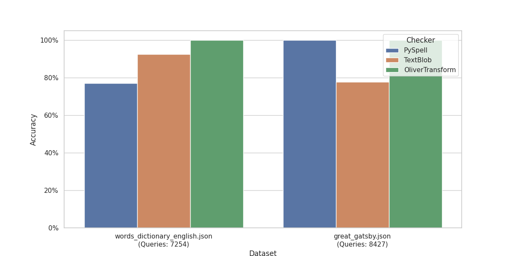
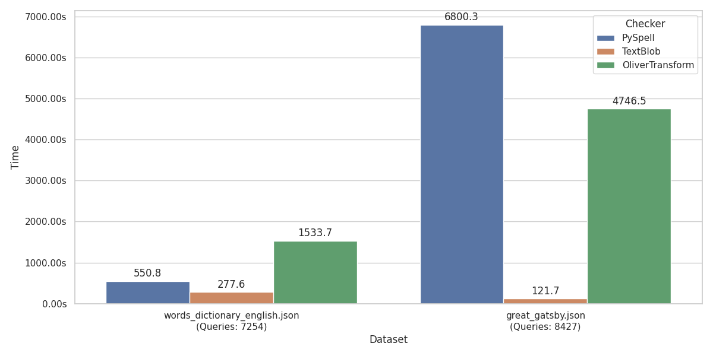

# Spellcheckers Benchmarks

The data is already generated and benchmarks are visible in `benchmarks` directory.

## Reproduction of Results:

### Setup

Use `script_name` script to install the right checkers onto your computer.

    pip install pyspellchecker textblob language-tool-python
    pip install datasets

### Visualize Results
To run the visualization of the current results:

    python3 -m controller.py visualize
### Run a New Benchmark

- For different data sizes, change `config.py` in `test_erroneous_data/`.
- For different benchmark batch sizes, change `Benchmark size` in `benchmark_script.py`.

To run a full benchmark:

    python3 -m controller.py all

## Report

### Overview
This benchmark was run on 2 datasets: 'words' and 'sentences'.
### Metrics
This benchmark uses only one metric $\frac{C}{T}$ where:
- $C$ is the number of mistakes correctly identified and changed.
- $T$ total number of queries

I choose this metric because even though it may be not the best in case of accurately measuring the performance of a spellchecker. The differences are more prominent and this metric in my opinion visualizes the use of spellcheckers in a real life scenario.

In the future i would like to implement new metrics which where contained in `Evaluating Evaluation Metrics for Spelling Checker Evaluations`
by `Gerhard B. van Huyssteen*, Roald Eiselen & Martin Puttkammer`

The paper has given some interesting incites to the problem i would like to put them to the test.

### Accuracy Results

### Time Taken Results

### Summary
The benchmark results show the performance of different spellcheckers.

#### PySpellChecker:
PySpellChecker is a simple, pure Python spell checking library that relies on a frequency-based algorithm to identify and correct misspelled words. It is lightweight and easy to use, making it suitable for small to medium-sized text processing tasks. However, it may not be as accurate as more advanced spell checkers for complex texts.

#### TextBlob:
TextBlob is a Python library for processing textual data. It provides a simple API for diving into common natural language processing (NLP) tasks such as part-of-speech tagging, noun phrase extraction, sentiment analysis, classification, translation, and more. TextBlob's spell checker is based on the `Pattern` library and uses a combination of algorithms to identify and correct misspelled words. It is known for its ease of use and integration with other NLP tasks.

#### TransformersSpellChecker:
TransformersSpellChecker leverages transformer-based models, such as those provided by the Hugging Face Transformers library, to perform spell checking. These models are trained on large datasets and can understand the context of words in a sentence, making them highly accurate for complex texts. However, they require more computational resources and may be slower compared to simpler spell checkers.

The OliverTransform is a proof of concept so with some tweaking it may achieve much better results.

#### Some observations:
- **PySpellChecker**: Achieved moderate accuracy with fast processing times, making it suitable for applications where speed is more critical than accuracy.
- **TextBlob**: Provided a good balance between accuracy and processing time, making it a versatile choice for various NLP tasks.
- **OliverTransform**: Achieved the highest accuracy due to its advanced transformer-based model but was really slow in terms of processing time. It is ideal for applications where accuracy is paramount, and computational resources are available.
___
Overall, the choice of spell checker depends on the specific requirements of the application, such as the need for accuracy, speed, and available computational resources.

**On the other hand LLM based spellcheckers may prove to be more useful when working with multiple languages no need to detect what language is being used thus we lose one layer of abstraction. Thus the best approach would be to integrate both of the solutions in the same time for easier problems use the fast solution and then use LLMs for more challenging spellchecks**

## Problems encountered along the way:
- Some spellcheckers where just old and not compatible with modern programs (Had to downgrade pytorch)
- Finding suitable checkers.
- Assuring that generated wrong words can be associated with the correct one on a 1-1 basis.
- The words have only minor mistakes because given enough noise in a word it may be closer to another word then the word to whom the noise was given.
- The same problem as above is even more evident in sentences while changing a word may provide still a valid sentences which is harder to detect (this isn't implemented in the benchmark in this project)

#### How this project can be improved:
- Add more datasets
- Add datasets containing different languages
- Find more spellCheckers
- Improve testing time on a better machine
- Implementing multiple Metrics (at some point it would be more confusing then informative)
- Finding a way to validate noise generating in sentences
- Finding a solution to harder data augmentation( how can we know without or with the context of the sentences is valid)
- Create a user friendly interaction system
- Implement more ways to add noise to data
